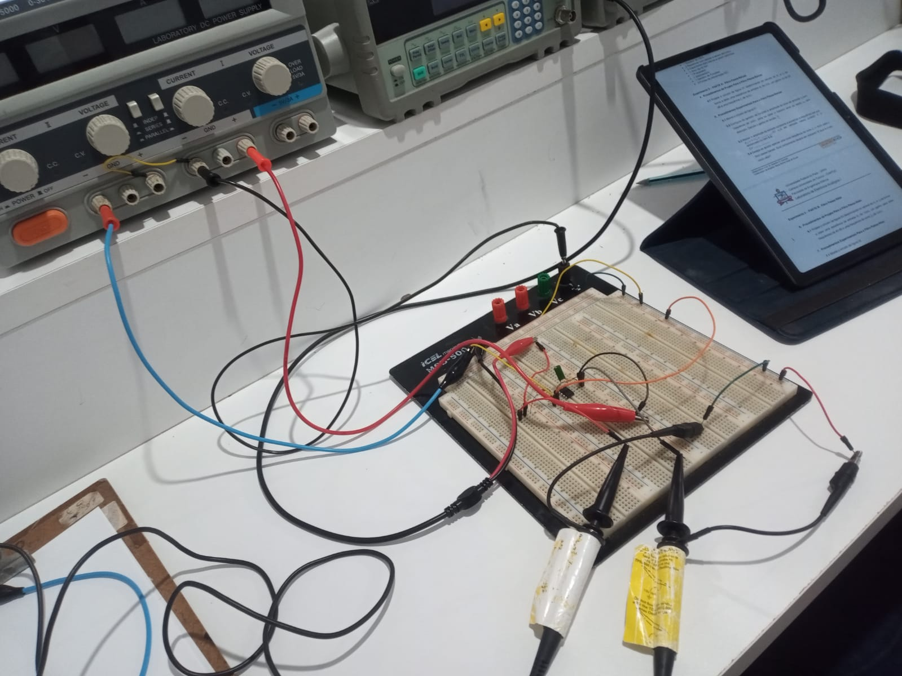

# LAB ELETRÔNICA ANALOGICA I

# Amplificador Operacional AMPOP

+ ### AMPOP Configuração Inversora
+ ### AMPOP Configuração Não-Inversora

+ ###  Filtro Ativo Passa-Baixas
+ ###  Filtro Ativo Passa-Altas

<h1 align="center">
  
</h1>

